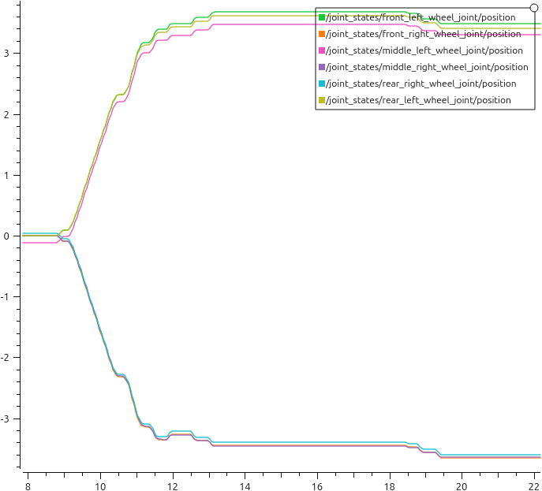
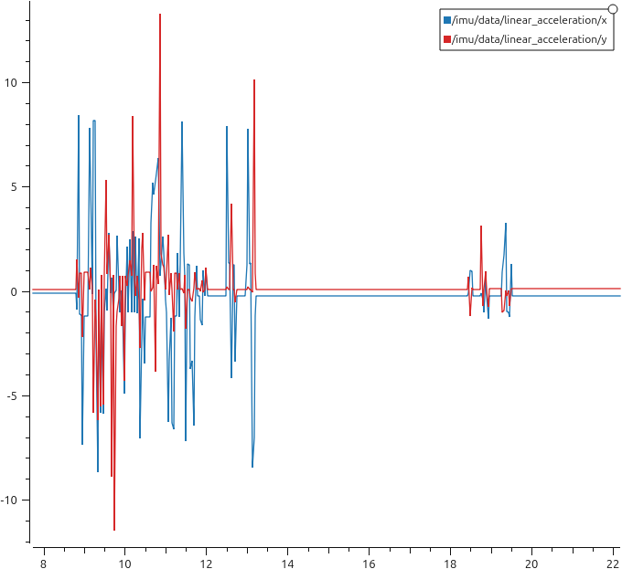
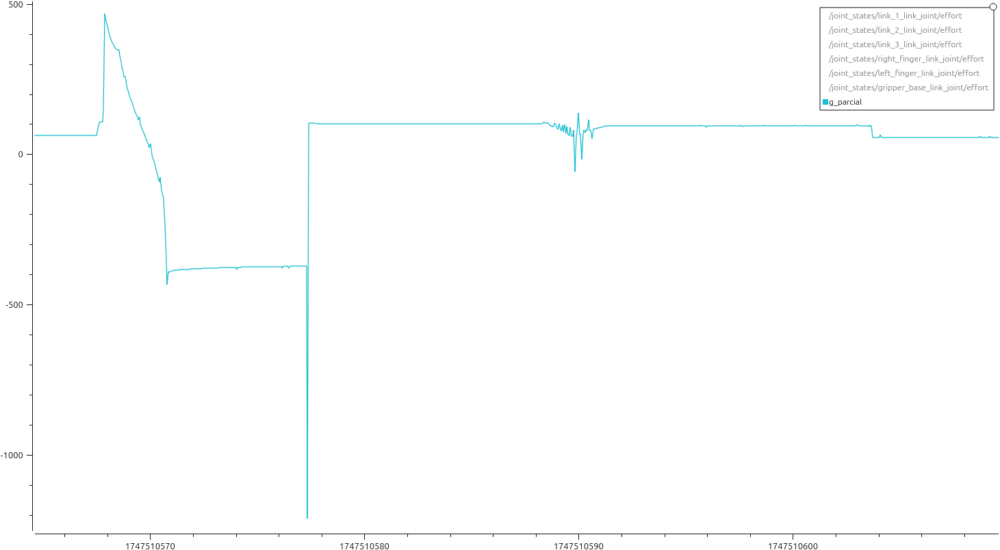
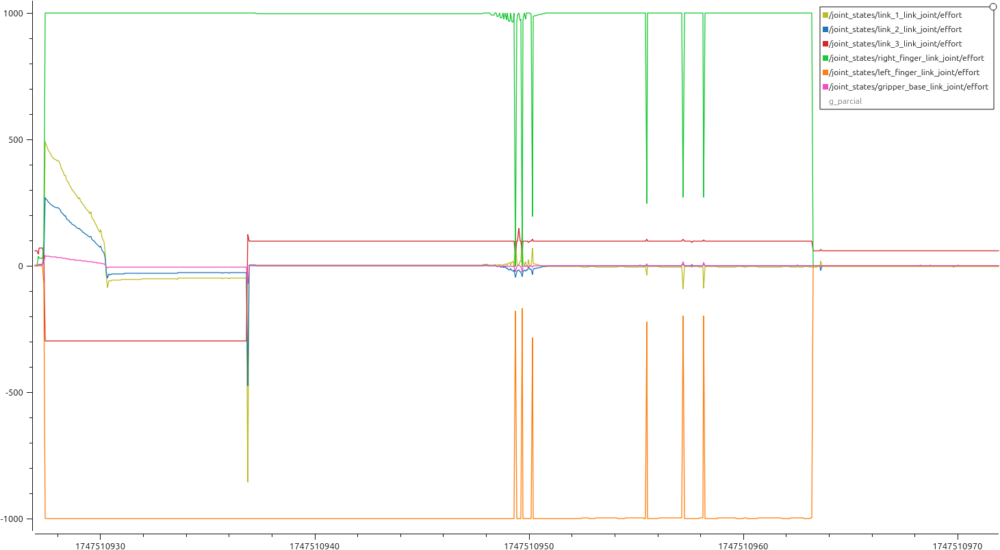

# modelado_practica3

En la anterior gráfica podemos ver cómo avanza la posición de los 6 joints de las ruedas respecto al tiempo. Observamos que los joints del lado izquierdo y los del lado derecho son simétricos respecto a 0. Esto se debe a que los joints están colocados en diferentes direcciones; por ende, podemos ver que uno es positivo y el otro negativo. Viendo la gráfica, también podemos asumir que el movimiento duró alrededor de 5 segundos (desde el segundo 9 al 14). A partir de ahí, se estabiliza y volvemos a ver un nuevo pequeño movimiento entre los segundos 18 y 20. Estos dos movimientos se deben a que, en primer lugar, hice un movimiento de aproximación al cubo y, tras revisar si su colocación era correcta, corregí un poco la posición, dando así explicación a ese segundo movimiento.

En la anterior gráfica vemos los datos obtenidos de la IMU. En este caso, están graficadas tanto la aceleración en x como en y. En esta gráfica podemos confirmar el doble movimiento que visualizábamos en la primera imagen, siendo en esta más clara la diferenciación entre ambos.

